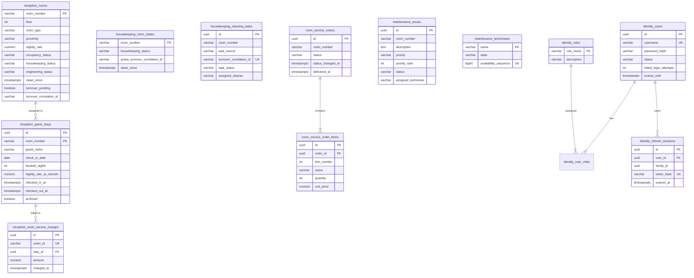

# HotelOS — Real-Time Hotel Operations Platform

HotelOS is a microservice-based hotel operations platform built with Java 17, Spring Boot 3.3.0, PostgreSQL 16, RabbitMQ, and WebSocket. It automates front desk management, multi-axial room state tracking, turnover cleaning queues, room service delivery with billing reconciliation, facility maintenance with priority queuing, and real-time operational monitoring.

---

## Overview

### Problem Statement
In traditional hospitality systems, hotel operations suffer from data coupling and race conditions:
- Room status is often modeled as a single monolithic enum (e.g. `CLEAN`, `OCCUPIED`, `MAINTENANCE`), causing operational conflicts (for example, completing a plumbing repair could accidentally mark an uncleaned room as `CLEAN` and sellable).
- Concurrent front-desk check-ins frequently result in double-booking rooms.
- Financial charges for room service orders can be lost, duplicated, or billed to the wrong guest stay when guests check out concurrently.
- Maintenance requests lack deterministic prioritization and fair technician dispatching.

HotelOS solves these problems by decomposing hotel operations into isolated bounded contexts, decoupling state changes via asynchronous events, enforcing strict transactional database constraints, and separating room status into three independent operational axes.

### Target Users
- **Front Desk Staff / Receptionists**: Manage reservations, assign rooms, check guests in/out, and calculate bills.
- **Housekeeping Personnel**: Monitor cleaning queues, start and complete room turnover tasks.
- **Room Service & Kitchen Staff**: Receive dining orders, update fulfillment statuses, and post charges to guest folios.
- **Engineering & Maintenance Staff**: Track facility issues, prioritize repairs, and dispatch technicians.
- **Hotel Operations Managers**: Monitor real-time operational metrics and system events via WebSocket live streams.
- **System Administrators**: Manage staff identity, RBAC roles, and authentication policies.

### Core End-to-End Workflow
1. A receptionist checks in a guest via `reception-service`. An available room is selected using row-level locking (`FOR UPDATE SKIP LOCKED`) to eliminate double-booking.
2. The room's occupancy axis transitions to `OCCUPIED`. A `room.occupancy.changed` domain event is recorded in the Transactional Outbox and dispatched to RabbitMQ.
3. The guest places an order via `room-service`. The order advances sequentially: `RECEIVED` → `PREPARING` → `DELIVERING` → `DELIVERED`.
4. Upon delivery, `room-service` publishes a `room.service.charge` event. `reception-service` consumes this event through a Durable Inbox, validating the historical guest stay and idempotently recording the charge in PostgreSQL using `ON CONFLICT (order_id) DO NOTHING`.
5. An urgent maintenance issue is reported via `maintenance-service`. The room's engineering status becomes `OUT_OF_ORDER`. A technician is claimed from a FIFO sequence pool, and `reception-service` updates the room's engineering axis. The room is no longer sellable.
6. The issue is resolved, returning the room to `OPERATIONAL`. The housekeeping axis remains untouched (`DIRTY`), preserving sanitation safety.
7. Upon guest check-out, final billing is calculated, the room is marked `VACANT`, and a `room.vacated` event is emitted with a unique `turnoverCorrelationId`.
8. `housekeeping-service` receives the event and inserts a cleaning task into the queue. A cleaner starts and marks the room `CLEAN`.
9. `reception-service` receives `room.housekeeping.status.changed`, verifies the correlation ID, clears `turnoverPending`, and the room becomes sellable once again.
10. All operations stream live to the browser-based dashboard via WebSocket.

---

## Key Features

- **Three-Axis Room State Model**: Independent tracking of Occupancy (`VACANT`, `OCCUPIED`), Housekeeping (`CLEAN`, `DIRTY`, `CLEANING`), and Engineering (`OPERATIONAL`, `OUT_OF_SERVICE`, `OUT_OF_ORDER`). A room is sellable if and only if `VACANT + CLEAN + OPERATIONAL + !turnoverPending`.
- **Concurrency-Safe Room Allocation**: Row-level database locking (`FOR UPDATE SKIP LOCKED`) prevents double-booking when multiple receptionists assign rooms simultaneously.
- **Turnover Lifecycle Correlation**: Room cleaning cycles are bound to a UUID `turnoverCorrelationId` to ensure stale cleaning events from older stays cannot prematurely mark a room sellable.
- **Fair Resource Dispatching**:
  - Housekeeping assigns cleaners deterministically using positive hash modulation (`Math.floorMod(roomNumber.hashCode(), cleaners.size())`).
  - Maintenance dispatches available technicians in fair FIFO order backed by a PostgreSQL database sequence (`technician_availability_seq`).
- **Priority-Ranked Maintenance Queue**: Issues are ranked dynamically in PostgreSQL (`CRITICAL(1)` > `HIGH(2)` > `NORMAL(3)` > `LOW(4)`) ordered by `priority_rank ASC, created_at ASC, id ASC`.
- **Durable Financial Idempotency**: Room service charges enforce an engine-level unique index on `order_id` in the billing ledger, preventing double-billing on retried events.
- **Transactional Outbox & Durable Inbox**: Business state mutations and outbound domain events are committed atomically in the same database transaction. Dedicated dispatcher jobs poll and publish events to RabbitMQ with publisher confirms. Consumer services deduplicate incoming events via SHA-256 envelope fingerprints.
- **Schema-Per-Bounded-Context Isolation**: All persistent services connect to dedicated PostgreSQL schemas (`reception`, `room_service`, `housekeeping`, `maintenance`, `identity`) with individual credentials. Cross-schema foreign keys and queries are forbidden at the database engine level.
- **RS256 JWT Authentication Engine**: Standalone `identity-service` signs 15-minute access JWTs using RSA-2048 keys (SHA256withRSA), tracks failed login attempts with 15-minute lockout thresholds, logs authentication audits, and manages refresh session rotation.
- **Real-Time WebSocket Dashboard**: `dashboard-service` subscribes to all hotel events via a topic wildcard (`#`) and broadcasts formatted JSON envelopes to connected browser sessions.
- **Unified Gateway Entry Point**: `gateway-service` exposes centralized routing, request proxying, aggregate snapshots, health aggregation, and interactive Swagger OpenAPI documentation.

---

## Architecture

HotelOS employs an event-driven microservices architecture with a centralized API gateway, asynchronous RabbitMQ communication, schema-per-service PostgreSQL persistence, and WebSocket push notifications.

```mermaid
flowchart TD
    Client[Browser / HTTP Client / Dashboard UI] -->|HTTP / REST :8090| Gateway[gateway-service]
    Client -->|WebSocket :8085| Dashboard[dashboard-service]
    Client -.->|Direct HTTP :8086| Identity[identity-service]

    subgraph "Edge / Entry Point"
        Gateway
    end

    subgraph "Core Microservices"
        Gateway -->|HTTP Proxy :8081| Reception[reception-service]
        Gateway -->|HTTP Proxy :8082| Housekeeping[housekeeping-service]
        Gateway -->|HTTP Proxy :8083| RoomService[room-service]
        Gateway -->|HTTP Proxy :8084| Maintenance[maintenance-service]
        Gateway -->|HTTP Proxy :8085| Dashboard
    end

    subgraph "Security & Identity"
        Identity
    end

    subgraph "Message Broker (RabbitMQ: hotel.events.topic)"
        Broker{{RabbitMQ 3.13}}
        Reception -->|Outbox Publish| Broker
        Housekeeping -->|Outbox Publish| Broker
        RoomService -->|Outbox Publish| Broker
        Maintenance -->|Outbox Publish| Broker
        Broker -->|room.vacated| Housekeeping
        Broker -->|room.housekeeping.* / room.engineering.* / room.service.charge| Reception
        Broker -->|# (All Events)| Dashboard
    end

    subgraph "Persistence (PostgreSQL 16: hotelos)"
        DB[(PostgreSQL 16)]
        Reception ---|schema: reception| DB
        Housekeeping ---|schema: housekeeping| DB
        RoomService ---|schema: room_service| DB
        Maintenance ---|schema: maintenance| DB
        Identity ---|schema: identity| DB
    end
```

---

## How the System Works

### 1. Check-In Request Flow (Synchronous Command + Asynchronous Projection)
```text
HTTP Client 
  → POST /api/reception/check-in
  → GatewayController.checkIn()
  → RestClient (HTTP POST :8081)
  → ReceptionController.checkIn()
  → RoomInventoryService.checkIn()
      ├── RoomRepository.findAvailableRoomForUpdate()  [SELECT ... FOR UPDATE SKIP LOCKED]
      ├── RoomEntity.occupy()
      ├── RoomRepository.save(room)
      ├── GuestStayRepository.save(guestStay)
      └── ReceptionOutboxService.enqueue(room.occupancy.changed)
          └── ReceptionOutboxRepository.save(outboxEvent)  [Same DB Transaction]
  → HTTP Response (CheckInResponse, 200 OK)

[Asynchronous Outbox Dispatcher]
ReceptionOutboxDispatcher.pollAndDispatch()
  → RabbitTemplate.send(hotel.events.topic, "room.occupancy.changed", correlationData)
  → Broker ACK received
  → ReceptionOutboxRepository.markPublished()

[Asynchronous Monitoring Projection]
RabbitMQ 
  → dashboard.all.events queue
  → EventForwarder.forward()
  → DashboardSocketHandler.broadcast()
  → Browser WebSocket UI updated live
```

### 2. Room Service Order to Billing Reconciliation Flow
```text
HTTP Client 
  → POST /api/room-service/orders
  → OrderWorkflowService.createOrder()
      └── OrderRepository.save(order with items)
  → PATCH /api/room-service/orders/{id}/next (repeated until DELIVERED)
      ├── OrderWorkflowService.nextStatus()
      ├── OrderRepository.save(order [DELIVERED])
      └── RoomServiceOutboxService.enqueue(room.service.charge)
  → RoomServiceOutboxDispatcher dispatches to RabbitMQ ("room.service.charge")

[Consumption by Reception Service]
RabbitMQ ("reception.room.service.charge")
  → RoomInventoryService.onRoomServiceCharge()
      ├── ReceptionInboxService.registerEvent()
      │     └── ReceptionInboxRepository.insertOnConflictDoNothing() [Deduplication]
      ├── GuestStayRepository.findStaysForRoomAtTime(roomNumber, chargeTime)
      ├── RoomServiceChargeRepository.insertChargeOnConflictDoNothing(orderId, stayId, amount)
      └── Charge logged into guest stay folio
```

### 3. Check-Out and Turnover Workflow
```text
HTTP Client 
  → POST /api/reception/check-out/{roomNumber}
  → RoomInventoryService.checkOut()
      ├── GuestStayEntity.setCheckedOutAt(now)
      ├── RoomEntity.vacate(turnoverCorrelationId)  [occupancy=VACANT, turnoverPending=TRUE]
      └── ReceptionOutboxService.enqueue(room.vacated with turnoverCorrelationId)
  → Outbox Dispatches "room.vacated" to RabbitMQ

[Consumption by Housekeeping Service]
RabbitMQ ("housekeeping.room.vacated")
  → HousekeepingService.onRoomVacated()
      ├── HousekeepingInboxService.registerEvent()
      ├── TurnoverProcessor.processVacatedWithInbox()
      │     ├── RoomStateRepository: set housekeepingStatus=DIRTY
      │     └── CleaningTaskRepository: create task (source=TURNOVER, status=WAITING)
  
[Cleaner Execution]
HTTP POST /api/housekeeping/rooms/{roomNumber}/start
  → Task transitions WAITING → CLEANING; RoomStateEntity becomes CLEANING
HTTP POST /api/housekeeping/rooms/{roomNumber}/clean
  → Task transitions CLEANING → CLEAN; RoomStateEntity becomes CLEAN
  → HousekeepingOutboxService.enqueue(room.housekeeping.status.changed with correlationId)

[Consumption by Reception Service]
RabbitMQ ("reception.housekeeping.room.status.changed")
  → RoomInventoryService.onHousekeepingStatusChanged()
      ├── Verifies event correlationId matches RoomEntity.turnoverCorrelationId
      ├── Sets RoomEntity.housekeepingStatus = CLEAN
      ├── Clears RoomEntity.turnoverPending = FALSE
      └── RoomEntity.isSellable() becomes TRUE
```

---

## Tech Stack

### Backend
- **Java**: 17 (Eclipse Temurin / OpenJDK 17)
- **Framework**: Spring Boot 3.3.0
- **Web**: Spring MVC (`spring-boot-starter-web`), Spring WebSocket (`spring-boot-starter-websocket`)
- **Data & Persistence**: Spring Data JPA (`spring-boot-starter-data-jpa`), Hibernate 6.5
- **Messaging**: Spring AMQP (`spring-boot-starter-amqp`)
- **Security Utilities**: Spring Security Crypto (`spring-security-crypto`) for BCrypt password hashing
- **JSON Serialization**: Jackson Databind, Jackson DataType JSR310
- **API Documentation**: SpringDoc OpenAPI Starter WebMVC UI 2.6.0 (Swagger 3)
- **Logging**: SLF4J with Logback

### Frontend
- **Dashboard UI**: Native HTML5, CSS3, Vanilla JavaScript (ES6+), WebSockets (embedded in `dashboard-service`)
- **API Explorer**: Swagger UI (embedded in `gateway-service`)

### Database
- **Database Engine**: PostgreSQL 16 (`postgres:16-alpine`)
- **Schema Management**: Flyway Database Migrations (`flyway-core`, `flyway-database-postgresql`)
- **Driver**: PostgreSQL JDBC Driver (`org.postgresql:postgresql`)

### Infrastructure
- **Containerization**: Docker, Dockerfile (multi-stage Maven builds)
- **Container Orchestration**: Docker Compose v2
- **Message Broker**: RabbitMQ 3.13 with Management Plugin (`rabbitmq:3.13-management`)

### Testing
- **Test Frameworks**: Spring Boot Starter Test (JUnit Jupiter, AssertJ, Mockito)
- **HTTP Scenarios**: IntelliJ IDEA HTTP Client (`test-scenarios.http`, `test-scenarios-gateway.http`)

### Dev Tools
- **Build Tool**: Apache Maven 3.9+
- **Cryptography**: OpenSSL (for RSA-2048 key pair generation)

---

## Project Structure

```text
HotelOS/
├── pom.xml                                   # Root Maven POM (dependency management & module aggregation)
├── docker-compose.yml                        # Docker Compose configuration (9 containers)
├── .env.example                              # Template environment variables for local & containerized run
├── test-scenarios.http                       # HTTP client integration test cases for direct service ports
├── test-scenarios-gateway.http               # HTTP client integration scenarios (TS-01 to TS-08) for Gateway
│
├── docker/
│   └── postgres/init/
│       └── 01-init-databases.sh              # SQL initialization: roles, permissions & schema provisioning
│
├── docs/
│   ├── auth.md                               # P2.2 Authentication & RS256 token specification
│   └── persistence.md                        # P1 Persistence architecture & schema isolation rules
│
├── secrets/                                  # Local development RSA keys (Git-ignored)
│   ├── jwt-private.pem                       # RSA private key (PKCS#8, mode 0600)
│   └── jwt-public.pem                        # RSA public key (X.509, mode 0644)
│
├── hotelos-common/                           # Shared event library & transport contracts
│   ├── pom.xml
│   └── src/main/java/com/hotelos/common/event/
│       ├── EventEnvelope.java                # Immutable generic envelope record
│       ├── EventTypes.java                   # Standard event type constants
│       ├── RoutingKeys.java                  # RabbitMQ routing key definitions
│       ├── MessagingConstants.java           # Exchange names and broker settings
│       ├── EnvelopeFingerprint.java          # SHA-256 fingerprint generator for Inbox deduplication
│       └── payload/                          # Event payload records (*Payload.java)
│
├── gateway-service/                          # API Gateway, Swagger aggregator & proxy controller
│   ├── Dockerfile
│   ├── pom.xml
│   └── src/main/java/com/hotelos/gateway/
│       ├── config/                           # RestClientConfig, ServiceUrls, OpenApiConfig
│       ├── controller/                       # GatewayController (routing, demo auth, scenario runners)
│       ├── dto/                              # Gateway request DTOs
│       └── exception/                        # GatewayExceptionHandler
│
├── identity-service/                         # Authentication & token issuance service
│   ├── Dockerfile
│   ├── pom.xml
│   ├── src/main/java/com/hotelos/identity/
│   │   ├── config/                           # RsaKeyProvider, SecurityCryptoConfig, OpenApiConfig
│   │   ├── domain/                           # UserStatus enum
│   │   ├── dto/                              # LoginRequest/Response, RefreshRequest/Response, LogoutRequest
│   │   ├── exception/                        # BadCredentialsException, InvalidRefreshTokenException
│   │   ├── persistence/
│   │   │   ├── entity/                       # UserEntity, RoleEntity, RefreshSessionEntity, AuthAuditLogEntity
│   │   │   └── repository/                   # UserRepository, RoleRepository, RefreshSessionRepository
│   │   ├── service/                          # AuthService, TokenService (RS256), AdminBootstrapService
│   │   └── web/                              # AuthController, IdentityHealthController, IdentityExceptionHandler
│   └── src/main/resources/
│       ├── application.yml
│       └── db/migration/V1__init_identity_schema.sql
│
├── reception-service/                        # Room inventory, reservations, guests & folio billing
│   ├── Dockerfile
│   ├── pom.xml
│   ├── src/main/java/com/hotelos/reception/
│   │   ├── config/                           # RabbitConfig (queues, topic exchange & bindings)
│   │   ├── controller/                       # ReceptionController
│   │   ├── domain/                           # Room, GuestStay, RoomType, OccupancyStatus, etc.
│   │   ├── dto/                              # CheckInRequest, CheckInResponse, CheckOutResponse
│   │   ├── exception/                        # GlobalExceptionHandler, HotelValidationException
│   │   ├── inbox/                            # ReceptionInboxService (deduplication & auditing)
│   │   ├── outbox/                           # ReceptionOutboxService, ReceptionOutboxDispatcher
│   │   ├── persistence/
│   │   │   ├── entity/                       # RoomEntity, GuestStayEntity, RoomServiceChargeEntity
│   │   │   └── repository/                   # RoomRepository, GuestStayRepository, RoomServiceChargeRepository
│   │   └── service/                          # RoomInventoryService, BillingService
│   └── src/main/resources/
│       ├── application.yml
│       └── db/migration/
│           ├── V1__init_reception_schema.sql
│           └── V2__add_outbox_inbox.sql
│
├── housekeeping-service/                     # Cleaning queues, cleaner assignment & room turnover
│   ├── Dockerfile
│   ├── pom.xml
│   ├── src/main/java/com/hotelos/housekeeping/
│   │   ├── config/                           # RabbitConfig
│   │   ├── controller/                       # HousekeepingController
│   │   ├── domain/                           # CleaningTask, CleaningStatus, TaskSource
│   │   ├── exception/                        # GlobalExceptionHandler, HotelValidationException
│   │   ├── inbox/                            # HousekeepingInboxService
│   │   ├── outbox/                           # HousekeepingOutboxService, HousekeepingOutboxDispatcher
│   │   ├── persistence/
│   │   │   ├── entity/                       # RoomStateEntity, CleaningTaskEntity
│   │   │   └── repository/                   # RoomStateRepository, CleaningTaskRepository
│   │   └── service/                          # HousekeepingService, TurnoverProcessor
│   └── src/main/resources/
│       ├── application.yml
│       └── db/migration/
│           ├── V1__init_housekeeping_schema.sql
│           └── V2__add_outbox_inbox.sql
│
├── room-service/                             # Dining orders, item catalog & charge generation
│   ├── Dockerfile
│   ├── pom.xml
│   ├── src/main/java/com/hotelos/roomservice/
│   │   ├── config/                           # RabbitConfig
│   │   ├── controller/                       # RoomServiceController
│   │   ├── domain/                           # RoomOrder, OrderItem, OrderStatus
│   │   ├── dto/                              # CreateOrderRequest
│   │   ├── exception/                        # GlobalExceptionHandler, HotelValidationException
│   │   ├── outbox/                           # RoomServiceOutboxService, RoomServiceOutboxDispatcher
│   │   ├── persistence/
│   │   │   ├── entity/                       # RoomServiceOrderEntity, OrderItemEntity
│   │   │   └── repository/                   # OrderRepository, OrderItemRepository
│   │   └── service/                          # OrderWorkflowService
│   └── src/main/resources/
│       ├── application.yml
│       └── db/migration/
│           ├── V1__init_room_service_schema.sql
│           └── V2__add_outbox.sql
│
├── maintenance-service/                      # Issue reporting, priority queue & technician dispatching
│   ├── Dockerfile
│   ├── pom.xml
│   ├── src/main/java/com/hotelos/maintenance/
│   │   ├── config/                           # RabbitConfig
│   │   ├── controller/                       # MaintenanceController
│   │   ├── domain/                           # MaintenanceIssue, IssuePriority, IssueStatus
│   │   ├── dto/                              # CreateIssueRequest
│   │   ├── exception/                        # GlobalExceptionHandler, HotelValidationException
│   │   ├── outbox/                           # MaintenanceOutboxService, MaintenanceOutboxDispatcher
│   │   ├── persistence/
│   │   │   ├── entity/                       # RoomStateEntity, MaintenanceIssueEntity, TechnicianEntity
│   │   │   └── repository/                   # RoomStateRepository, MaintenanceIssueRepository, TechnicianRepository
│   │   └── service/                          # MaintenanceWorkflowService, MaintenanceTransactionService
│   └── src/main/resources/
│       ├── application.yml
│       └── db/migration/
│           ├── V1__init_maintenance_schema.sql
│           └── V2__add_outbox.sql
│
└── dashboard-service/                        # Real-time event consumption, WebSocket push & web UI
    ├── Dockerfile
    ├── pom.xml
    ├── src/main/java/com/hotelos/dashboard/
    │   ├── config/                           # RabbitConfig, WebSocketConfig
    │   ├── controller/                       # DashboardController
    │   ├── service/                          # EventForwarder (in-memory history)
    │   └── websocket/                        # DashboardSocketHandler
    └── src/main/resources/
        ├── application.yml
        └── static/index.html                 # Single-page HTML5/JS monitoring dashboard
```

---

## Modules / Services

### 1. `hotelos-common`
- **Purpose**: Defines shared event contracts, event envelope records, topic exchange routing keys, and inbox SHA-256 fingerprint hashing utilities across all services.
- **Main Classes**: `EventEnvelope`, `EventTypes`, `RoutingKeys`, `MessagingConstants`, `EnvelopeFingerprint`, `RoomOccupancyChangedPayload`, `RoomVacatedPayload`, `RoomHousekeepingStatusChangedPayload`, `RoomEngineeringStatusChangedPayload`, `RoomServiceChargePayload`, `RoomServiceOrderUpdatedPayload`, `MaintenanceIssueUpdatedPayload`.
- **Dependencies**: Jackson Annotations, Jackson Databind, Jackson JSR310 Datatype.

### 2. `gateway-service` (Port: 8090)
- **Purpose**: Provides a unified HTTP entry point, aggregates OpenAPI documentation for Swagger UI, proxies client calls to downstream microservices using `RestClient`, and provides runnable assignment scenarios.
- **Main Classes**: `GatewayController`, `GatewayExceptionHandler`, `RestClientConfig`, `ServiceUrls`, `OpenApiConfig`.
- **Flow**: Incoming requests matching `/api/{service}/**` are mapped in `GatewayController`, validated, forwarded to downstream microservices over HTTP, and sanitized before returning to the caller.
- **Dependencies**: `hotelos-common`, `spring-boot-starter-web`, `springdoc-openapi-starter-webmvc-ui`.

### 3. `identity-service` (Port: 8086, Schema: `identity`)
- **Purpose**: Authenticates staff credentials, enforces brute-force account lockout policies, creates audit trails, issues RS256-signed 15-minute access JWTs, and manages refresh token sessions.
- **Main Classes**: `AuthController`, `AuthService`, `TokenService`, `RefreshTokenService`, `AdminBootstrapService`, `RsaKeyProvider`, `UserRepository`, `RefreshSessionRepository`, `AuthAuditLogRepository`, `UserEntity`, `RoleEntity`.
- **Flow**: Client calls `/api/auth/login` → `AuthService` verifies BCrypt password against `identity.users` → records `LOGIN_SUCCESS` in `identity.auth_audit_log` → `TokenService` signs RS256 JWT using private key → `RefreshTokenService` stores hashed refresh token in `identity.refresh_sessions`.
- **Dependencies**: `hotelos-common`, `spring-boot-starter-web`, `spring-boot-starter-data-jpa`, `flyway-database-postgresql`, `spring-security-crypto`.

### 4. `reception-service` (Port: 8081, Schema: `reception`)
- **Purpose**: Manages hotel rooms, guest stays, reservations, check-in, check-out, and folio billing ledger.
- **Main Classes**: `ReceptionController`, `RoomInventoryService`, `BillingService`, `RoomRepository`, `GuestStayRepository`, `RoomServiceChargeRepository`, `ReceptionOutboxService`, `ReceptionOutboxDispatcher`, `ReceptionInboxService`, `RoomEntity`, `GuestStayEntity`, `RoomServiceChargeEntity`.
- **Flow**:
  - Check-in: Checks room availability with pessimistic row locking (`FOR UPDATE SKIP LOCKED`), updates occupancy to `OCCUPIED`, saves `GuestStayEntity`, and records `room.occupancy.changed` in the outbox table.
  - Check-out: Closes stay (`checkedOutAt`), calculates bill, sets room `occupancyStatus = VACANT` and `turnoverPending = true`, and enqueues `room.vacated`.
  - Inbound events: Consumes `room.housekeeping.status.changed`, `room.engineering.status.changed`, and `room.service.charge` through `ReceptionInboxService`.
- **Dependencies**: `hotelos-common`, `spring-boot-starter-web`, `spring-boot-starter-amqp`, `spring-boot-starter-data-jpa`, `flyway-database-postgresql`.

### 5. `housekeeping-service` (Port: 8082, Schema: `housekeeping`)
- **Purpose**: Coordinates room cleaning tasks, assigns cleaners, and tracks turnover lifecycle.
- **Main Classes**: `HousekeepingController`, `HousekeepingService`, `TurnoverProcessor`, `RoomStateRepository`, `CleaningTaskRepository`, `HousekeepingOutboxService`, `HousekeepingOutboxDispatcher`, `HousekeepingInboxService`, `RoomStateEntity`, `CleaningTaskEntity`.
- **Flow**: Listens for `room.vacated` → `TurnoverProcessor` verifies inbox and creates `CleaningTaskEntity` (`WAITING`, `source=TURNOVER`) → Cleaner starts task (`CLEANING`) → Cleaner marks clean (`CLEAN`) → Outbox emits `room.housekeeping.status.changed`.
- **Dependencies**: `hotelos-common`, `spring-boot-starter-web`, `spring-boot-starter-amqp`, `spring-boot-starter-data-jpa`, `flyway-database-postgresql`.

### 6. `room-service` (Port: 8083, Schema: `room_service`)
- **Purpose**: Manages guest food and beverage orders and produces charges upon fulfillment.
- **Main Classes**: `RoomServiceController`, `OrderWorkflowService`, `OrderRepository`, `OrderItemRepository`, `RoomServiceOutboxService`, `RoomServiceOutboxDispatcher`, `RoomServiceOrderEntity`, `OrderItemEntity`.
- **Flow**: Order created (`RECEIVED`) → Advanced to `PREPARING` → `DELIVERING` → `DELIVERED` → Outbox atomically enqueues `room.service.order.updated` and `room.service.charge`.
- **Dependencies**: `hotelos-common`, `spring-boot-starter-web`, `spring-boot-starter-amqp`, `spring-boot-starter-data-jpa`, `flyway-database-postgresql`.

### 7. `maintenance-service` (Port: 8084, Schema: `maintenance`)
- **Purpose**: Records facility issues, ranks issues by priority, manages technician dispatching, and controls room engineering availability.
- **Main Classes**: `MaintenanceController`, `MaintenanceWorkflowService`, `MaintenanceTransactionService`, `MaintenanceIssueRepository`, `TechnicianRepository`, `RoomStateRepository`, `MaintenanceOutboxService`, `MaintenanceOutboxDispatcher`, `MaintenanceIssueEntity`, `TechnicianEntity`, `RoomStateEntity`.
- **Flow**: Issue reported → `MaintenanceTransactionService` locks room state, marks room `OUT_OF_ORDER`, persists issue with priority rank (1–4), and attempts to claim an available technician using `claimNextAvailableTechnician()` (`FOR UPDATE SKIP LOCKED`). Upon resolve, technician is released with a new availability sequence number, and room engineering status returns to `OPERATIONAL` if no active issues remain.
- **Dependencies**: `hotelos-common`, `spring-boot-starter-web`, `spring-boot-starter-amqp`, `spring-boot-starter-data-jpa`, `flyway-database-postgresql`.

### 8. `dashboard-service` (Port: 8085, In-Memory)
- **Purpose**: Real-time event consumption, live operational monitoring, and WebSocket streaming to browser clients.
- **Main Classes**: `DashboardController`, `EventForwarder`, `DashboardSocketHandler`, `RabbitConfig`, `WebSocketConfig`.
- **Flow**: Subscribes to `dashboard.all.events` (bound to `#`) → `EventForwarder.forward()` records message in in-memory history → `DashboardSocketHandler.broadcast()` pushes JSON text frames to all active WebSocket sessions.
- **Dependencies**: `hotelos-common`, `spring-boot-starter-web`, `spring-boot-starter-amqp`, `spring-boot-starter-websocket`.

---

## API Overview

### Gateway & Aggregated Endpoints (Port 8090)

| Method | Endpoint | Description |
|---|---|---|
| `GET` | `/api/gateway/health` | Gateway health status and Swagger UI link |
| `GET` | `/api/gateway/info` | System metadata and Swagger UI link |
| `GET` | `/api/gateway/routes` | Listing of proxied route patterns (ADMIN only) |
| `POST` | `/api/auth/login` | Staff authentication endpoint (proxies to Identity, returns RS256 JWT & refresh token) |
| `POST` | `/api/auth/refresh` | Rotates refresh token and issues new access JWT |
| `POST` | `/api/auth/logout` | Revokes refresh session |
| `GET` | `/api/reception/rooms` | Lists all hotel rooms with occupancy, housekeeping & engineering statuses |
| `GET` | `/api/reception/rooms/{roomNumber}` | Retrieves room details by room number |
| `GET` | `/api/reception/rooms/available` | Queries sellable rooms (optional filters: `roomType`, `floor`) |
| `POST` | `/api/reception/check-in` | Assigns an available room and checks in a guest |
| `POST` | `/api/reception/check-out/{roomNumber}` | Checks out a guest, closes stay, and initiates turnover |
| `GET` | `/api/reception/guests` | Lists all active guest stays |
| `GET` | `/api/reception/guests/by-room/{roomNumber}` | Retrieves active guest stay for a specific room |
| `PATCH`| `/api/reception/guests/{guestId}/archive` | Marks a completed guest stay as archived |
| `POST` | `/api/reception/bills/{roomNumber}/calculate` | Calculates folio total (room charges, room service, fees, discounts) |
| `GET` | `/api/housekeeping/queue` | Retrieves all active room cleaning tasks |
| `POST` | `/api/housekeeping/rooms/{roomNumber}/start` | Transitions cleaning task status from `WAITING` to `CLEANING` |
| `POST` | `/api/housekeeping/rooms/{roomNumber}/clean` | Completes cleaning task and updates room to `CLEAN` |
| `PATCH`| `/api/housekeeping/queue/{roomNumber}/cancel` | Cancels a manual cleaning task (turnover tasks cannot be cancelled) |
| `GET` | `/api/housekeeping/cleaners` | Lists registered cleaners |
| `GET` | `/api/room-service/orders` | Lists all room service orders |
| `GET` | `/api/room-service/orders/{orderId}` | Retrieves a room service order by UUID |
| `POST` | `/api/room-service/orders` | Places a new dining order for a room |
| `PATCH`| `/api/room-service/orders/{orderId}/next` | Advances order lifecycle (`RECEIVED` → `PREPARING` → `DELIVERING` → `DELIVERED`) |
| `PATCH`| `/api/room-service/orders/{orderId}/cancel` | Cancels an active room service order |
| `GET` | `/api/room-service/charges/{roomNumber}` | Aggregates delivered order charges for a room |
| `GET` | `/api/maintenance/issues` | Lists all recorded maintenance issues |
| `GET` | `/api/maintenance/issues/{issueId}` | Retrieves maintenance issue details by UUID |
| `POST` | `/api/maintenance/issues` | Reports a new maintenance issue (marks room `OUT_OF_ORDER`) |
| `GET` | `/api/maintenance/queue` | Returns snapshot of open maintenance issues ordered by priority rank |
| `POST` | `/api/maintenance/queue/process-next` | Assigns next open maintenance issue to next available technician |
| `PATCH`| `/api/maintenance/issues/{issueId}/resolve` | Resolves issue, releases technician, and restores room if clear |
| `PATCH`| `/api/maintenance/issues/{issueId}/cancel` | Cancels issue and releases assigned technician |
| `GET` | `/api/maintenance/technicians` | Lists registered maintenance technicians |
| `GET` | `/api/dashboard/snapshot` | Aggregates current operational state across all microservices |
| `GET` | `/api/dashboard/events` | Retrieves history of received RabbitMQ events |
| `DELETE`| `/api/dashboard/events` | Clears stored event history |
| `POST` | `/api/demo/reset` | Resets all microservices to a clean state |
| `POST` | `/api/demo/seed` | Seeds default rooms and initial guest stays across services |
| `POST` | `/api/demo/run/ts-01` .. `ts-08` | Executes automated end-to-end integration scenarios |

### Identity Service Direct Endpoints (Port 8086)

| Method | Endpoint | Description |
|---|---|---|
| `POST` | `/api/auth/login` | Authenticates staff credentials against PostgreSQL and issues RS256 JWT |
| `POST` | `/api/auth/refresh` | Rotates refresh token family and issues new RS256 access JWT |
| `POST` | `/api/auth/logout` | Revokes the active refresh token session |
| `GET` | `/api/identity/health` | Service health check |

---

### Key API Request & Response Examples

#### 1. Check-In Guest (`POST /api/reception/check-in`)
**Request Body**:
```json
{
  "guestName": "Alice Smith",
  "roomType": "DOUBLE",
  "nights": 2,
  "preferredFloor": 3,
  "proximityPreference": "LIFT"
}
```
**Response (`200 OK`)**:
```json
{
  "stayId": "48b04775-38f7-4885-bd6f-00aa1ce76b39",
  "guestName": "Alice Smith",
  "roomNumber": "301",
  "roomType": "DOUBLE",
  "occupancyStatus": "OCCUPIED",
  "message": "Guest checked in successfully"
}
```

#### 2. Create Room Service Order (`POST /api/room-service/orders`)
**Request Body**:
```json
{
  "roomNumber": "301",
  "items": [
    { "name": "Club Sandwich", "quantity": 1, "unitPrice": 12.50 },
    { "name": "Fresh Orange Juice", "quantity": 2, "unitPrice": 4.00 }
  ]
}
```
**Response (`200 OK`)**:
```json
{
  "orderId": "a1b2c3d4-e5f6-7a8b-9c0d-1e2f3a4b5c6d",
  "roomNumber": "301",
  "items": [
    { "name": "Club Sandwich", "quantity": 1, "unitPrice": 12.50 },
    { "name": "Fresh Orange Juice", "quantity": 2, "unitPrice": 4.00 }
  ],
  "status": "RECEIVED",
  "createdAt": "2026-09-27T18:00:00Z",
  "statusChangedAt": "2026-09-27T18:00:00Z"
}
```

#### 3. Report Maintenance Issue (`POST /api/maintenance/issues`)
**Request Body**:
```json
{
  "roomNumber": "101",
  "description": "Air conditioner leaking water",
  "priority": "HIGH"
}
```
**Response (`200 OK`)**:
```json
{
  "id": "e9f0a1b2-c3d4-4e5f-a6b7-c8d9e0f1a2b3",
  "roomNumber": "101",
  "description": "Air conditioner leaking water",
  "priority": "HIGH",
  "status": "ASSIGNED",
  "assignedTechnician": "Tech-1",
  "createdAt": "2026-09-27T18:05:00Z",
  "assignedAt": "2026-09-27T18:05:00Z"
}
```

#### 4. Staff Login via Identity Service (`POST :8086/api/auth/login`)
**Request Body**:
```json
{
  "username": "admin.staff",
  "password": "SecurePassword123!"
}
```
**Response (`200 OK`)**:
```json
{
  "accessToken": "eyJhbGciOiJSUzI1NiIsImtpZCI6ImhvdGVsb3MtcnNhLWtleS0xIiwidHlwIjoiSldUIn0...",
  "tokenType": "Bearer",
  "expiresIn": 900,
  "refreshToken": "7f8a9b0c1d2e3f4a5b6c7d8e9f0a1b2c3d4e5f6a7b8c9d0e1f2a3b4c5d6e7f8a"
}
```

---

## Database

HotelOS uses a single PostgreSQL 16 container (`hotelos-postgres`) with **Schema-per-Bounded-Context** isolation. Cross-schema joins, queries, and foreign keys are strictly prohibited.



### Flyway Migrations Summary

| Service | Schema | Migration Scripts |
|---|---|---|
| `reception-service` | `reception` | `V1__init_reception_schema.sql`<br>`V2__add_outbox_inbox.sql` |
| `housekeeping-service` | `housekeeping` | `V1__init_housekeeping_schema.sql`<br>`V2__add_outbox_inbox.sql` |
| `room-service` | `room_service` | `V1__init_room_service_schema.sql`<br>`V2__add_outbox.sql` |
| `maintenance-service` | `maintenance` | `V1__init_maintenance_schema.sql`<br>`V2__add_outbox.sql` |
| `identity-service` | `identity` | `V1__init_identity_schema.sql` |
| `dashboard-service` | `dashboard_read` | In-memory only (schema reserved in init script) |

---

## Events / Real-Time Communication

### RabbitMQ Topology
- **Exchange**: `hotel.events.topic` (Topic Exchange, durable=true, autoDelete=false)
- **Message Format**: All published messages encapsulate payload data within a standard `EventEnvelope<T>` record.

```json
{
  "eventId": "c7a1b8d2-3e4f-4a5b-9c6d-7e8f9a0b1c2d",
  "eventType": "room.vacated",
  "eventVersion": 1,
  "occurredAt": "2026-09-27T18:30:00Z",
  "source": "reception-service",
  "aggregateId": "204",
  "correlationId": "5a4b3c2d-1e0f-9a8b-7c6d-5e4f3a2b1c0d",
  "payload": {
    "roomNumber": "204",
    "vacatedAt": "2026-09-27T18:30:00Z"
  }
}
```

### Event Routing Table

| Routing Key | Event Type | Publisher | Queue Name | Consumer | Purpose |
|---|---|---|---|---|---|
| `room.occupancy.changed` | `room.occupancy.changed` | Reception | `dashboard.all.events` | Dashboard | Broadcast room occupied/vacated status |
| `room.vacated` | `room.vacated` | Reception | `housekeeping.room.vacated` | Housekeeping | Triggers automated turnover cleaning task |
| `room.housekeeping.status.changed` | `room.housekeeping.status.changed` | Housekeeping | `reception.housekeeping.room.status.changed` | Reception | Updates room cleaning state & clears turnoverPending |
| `room.engineering.status.changed` | `room.engineering.status.changed` | Maintenance | `reception.maintenance.room.status.changed` | Reception | Sets room OUT_OF_ORDER or restores OPERATIONAL |
| `room.service.order.updated` | `room.service.order.updated` | Room Service | `dashboard.all.events` | Dashboard | Broadcasts order progression status |
| `room.service.charge` | `room.service.charge` | Room Service | `reception.room.service.charge` | Reception | Posts delivered order charge to guest folio |
| `maintenance.issue.updated` | `maintenance.issue.updated` | Maintenance | `dashboard.all.events` | Dashboard | Broadcasts maintenance repair progress |
| `#` | (Wildcard) | All Services | `dashboard.all.events` | Dashboard | Real-time WebSocket forwarding to clients |

---

## Security

### Current Implementation Status
1. **`identity-service`**:
   - **Algorithm**: RS256 (`SHA256withRSA`) with 2048-bit RSA key pair.
   - **Private Key**: `/secrets/jwt-private.pem` (restricted exclusively to `identity-service`).
   - **Public Key**: `/secrets/jwt-public.pem` (available for token verification).
   - **Access Token Lifetime**: 900 seconds (15 minutes).
   - **Claims**: `iss` (`hotelos-identity`), `aud` (`hotelos-api`), `sub` (UUID), `username`, `roles` array, `iat`, `exp`, `jti`.
   - **Lockout Policy**: Accounts lock for 15 minutes after 5 consecutive failed login attempts.
   - **Audit Trail**: Stored in PostgreSQL `identity.auth_audit_log`.
2. **`gateway-service`**:
   - Enforces the external security boundary via Spring Security Resource Server with RS256 JWT validation using public RSA key (`jwt-public.pem`).
   - Strictly validates `alg=RS256`, `kid=hotelos-rsa-key-1`, `iss=hotelos-identity`, `aud=hotelos-api`, and token expiration (`exp > now`, max 60s clock skew).
   - Maps JWT `roles` array to Spring Granted Authorities (`ROLE_*`) and enforces coarse-grained RBAC per service.
   - Forwards original `Authorization: Bearer <token>` to downstream internal microservices while stripping client spoofing headers.
3. **`dashboard-service`**:
   - Protects WebSocket connections via query parameter matching `?token=hotelos-demo-token` (*[LEGACY DEVELOPMENT WEBSOCKET AUTH]* — scheduled to be replaced in stage P2.7 with secure one-time WS tickets; DO NOT use as production security).

---

## Getting Started

### Prerequisites
- **Git**
- **Docker Engine** 24.0+ & **Docker Compose** v2.20+
- **Java Development Kit (JDK)** 17 (if running outside Docker)
- **Apache Maven** 3.9+ (if building outside Docker)
- **OpenSSL** (to generate RSA keys for identity-service)

---

## Running with Docker

### 1. Clone Repository & Setup Environment
```bash
git clone https://github.com/RahimovShaxriyor/hotelos-microservices.git
cd hotelos-microservices

# Copy template environment variables
cp .env.example .env
```

### 2. Generate RSA Key Pair
The `identity-service` requires a 2048-bit RSA key pair in PKCS#8 format:
```bash
mkdir -p secrets

# Generate RSA private key (PKCS#8)
openssl genpkey -algorithm RSA -out secrets/jwt-private.pem -pkeyopt rsa_keygen_bits:2048

# Extract public key (X.509)
openssl rsa -pubout -in secrets/jwt-private.pem -out secrets/jwt-public.pem

# Secure permissions
chmod 600 secrets/jwt-private.pem
chmod 644 secrets/jwt-public.pem
```

### 3. Build & Start All Services
```bash
docker compose up -d --build
```

### 4. Verify Services
```bash
# Check container status (ensure all containers show healthy / up)
docker compose ps

# View unified logs
docker compose logs -f gateway-service
```

### 5. Stop Services
```bash
docker compose down
```

---

## Running Locally

To run the application locally on your host machine while running PostgreSQL and RabbitMQ in Docker:

### 1. Start Infrastructure Dependencies
```bash
docker compose up -d postgres rabbitmq
```

### 2. Build All Modules
```bash
mvn clean install -DskipTests
```

### 3. Run Microservices (Separate Terminals)
```bash
# Terminal 1: Identity Service
mvn spring-boot:run -pl identity-service

# Terminal 2: Reception Service
mvn spring-boot:run -pl reception-service

# Terminal 3: Housekeeping Service
mvn spring-boot:run -pl housekeeping-service

# Terminal 4: Room Service
mvn spring-boot:run -pl room-service

# Terminal 5: Maintenance Service
mvn spring-boot:run -pl maintenance-service

# Terminal 6: Dashboard Service
mvn spring-boot:run -pl dashboard-service

# Terminal 7: Gateway Service
mvn spring-boot:run -pl gateway-service
```

---

## Environment Variables

| Variable | Required | Description | Safe Development Example |
|---|---|---|---|
| `POSTGRES_USER` | No | PostgreSQL superuser | `postgres` |
| `POSTGRES_PASSWORD` | No | PostgreSQL superuser password | `postgres_dev_password` |
| `POSTGRES_DB` | No | Logical database name | `hotelos` |
| `POSTGRES_PORT` | No | Host port mapped to PostgreSQL | `5434` |
| `SPRING_RABBITMQ_HOST` | No | RabbitMQ broker hostname | `localhost` (host) / `rabbitmq` (docker) |
| `HOTELOS_JWT_PUBLIC_KEY_PATH` | No | Path to RSA public key (PEM) for JWT verification | `secrets/jwt-public.pem` |
| `DASHBOARD_TOKEN` | No | Legacy token for WebSocket handshake (dev only, to be replaced in P2.7) | `hotelos-demo-token` |
| `RECEPTION_DB_USER` | No | Username for reception schema | `reception_user` |
| `RECEPTION_DB_PASSWORD` | No | Password for reception user | `reception_dev_pass` |
| `HOUSEKEEPING_DB_USER` | No | Username for housekeeping schema | `housekeeping_user` |
| `HOUSEKEEPING_DB_PASSWORD`| No | Password for housekeeping user | `housekeeping_dev_pass` |
| `ROOM_SERVICE_DB_USER` | No | Username for room_service schema | `room_service_user` |
| `ROOM_SERVICE_DB_PASSWORD`| No | Password for room_service user | `room_service_dev_pass` |
| `MAINTENANCE_DB_USER` | No | Username for maintenance schema | `maintenance_user` |
| `MAINTENANCE_DB_PASSWORD` | No | Password for maintenance user | `maintenance_dev_pass` |
| `IDENTITY_DB_USER` | No | Username for identity schema | `identity_user` |
| `IDENTITY_DB_PASSWORD` | No | Password for identity user | `identity_dev_pass` |
| `HOTELOS_BOOTSTRAP_ADMIN_USERNAME` | No | Bootstrap admin username | `admin.staff` |
| `HOTELOS_BOOTSTRAP_ADMIN_PASSWORD` | No | Bootstrap admin password | `AdminSecurePass123!` |
| `HOTELOS_JWT_PRIVATE_KEY_PATH` | No | Path to RSA private key | `/secrets/jwt-private.pem` |
| `HOTELOS_JWT_PUBLIC_KEY_PATH` | No | Path to RSA public key | `/secrets/jwt-public.pem` |

---

## Health Checks

All microservices provide dedicated HTTP health endpoints:

```text
GET http://localhost:8090/api/gateway/health       # Gateway Service
GET http://localhost:8086/api/identity/health      # Identity Service
GET http://localhost:8085/api/dashboard/health     # Dashboard Service
```

Docker containers also configure native health checks:
- **PostgreSQL**: `pg_isready -U postgres -d hotelos`
- **RabbitMQ**: `rabbitmq-diagnostics check_port_connectivity`

---

## Testing

### Current Testing Status
- **Automated Tests**: Unit and integration test suites using `@SpringBootTest` and Testcontainers are currently not implemented (0 test classes in `src/test/java`).
- **HTTP Scenario Testing**: End-to-end integration and boundary scenarios are tested via IntelliJ IDEA HTTP client files:
  - `test-scenarios-gateway.http`: Covers full API scenarios through Gateway (TS-01 to TS-08).
  - `test-scenarios.http`: Covers direct service requests.

### Running Automated Scenarios via Gateway
You can trigger scenarios directly through the Gateway:
```bash
# Run Scenario TS-01 (Check-in double room with preference)
curl -X POST http://localhost:8090/api/demo/run/ts-01

# Run Scenario TS-02 (Check-out room 204)
curl -X POST http://localhost:8090/api/demo/run/ts-02

# Run Scenario TS-04 (Room service ordering workflow)
curl -X POST http://localhost:8090/api/demo/run/ts-04

# Run Scenario TS-05 (Report critical maintenance issue)
curl -X POST http://localhost:8090/api/demo/run/ts-05

# Run Scenario TS-06 (Concurrent check-in contention test)
curl -X POST http://localhost:8090/api/demo/run/ts-06
```

### Executing Maven Builds & Tests
```bash
mvn test
```

---

## Development Guide

### Adding a New Business Operation
When implementing a new capability (e.g., adding minibar consumption to Reception):
1. **Database Migration**: Create `V{n}__{description}.sql` in `<service>/src/main/resources/db/migration/`. Use Flyway conventions (UTC `TIMESTAMPTZ`, decimal `NUMERIC(19,2)`, check constraints).
2. **Entity & Repository**: Create or update the JPA entity in `persistence/entity/` and declare queries in `persistence/repository/`. Enforce pessimistic locking (`FOR UPDATE`) for concurrent state transitions.
3. **Domain Event Contract**: If cross-service synchronization is required, define a payload record in `hotelos-common/src/main/java/com/hotelos/common/event/payload/` and register the routing key in `RoutingKeys.java`.
4. **Service & Transactional Outbox**: Implement business logic in the service class with `@Transactional`. Enqueue domain events via `OutboxService.enqueue()` within the same transaction.
5. **Controller & DTO**: Expose the endpoint in `controller/` and mirror the request/response DTO in `gateway-service`.
6. **Gateway Routing**: Expose the route in `GatewayController` and document with Swagger `@Operation` annotations.

---

## Coding Conventions

- **Schema Isolation**: Never write cross-schema SQL joins or foreign keys.
- **Transactional Outbox**: Never publish directly to RabbitMQ inside a business transaction. Always persist to `outbox_events` first; allow the background dispatcher to publish with publisher confirms.
- **Consumer Projections**: Consumers updating local projections must never republish the event they consumed.
- **Idempotent Ingestion**: All incoming RabbitMQ events must be checked against `InboxService.registerEvent()` before mutating domain state.
- **Immutability**: DTOs and event payloads must be defined as Java `record`.
- **Concurrency**: Use database-level row locks (`FOR UPDATE SKIP LOCKED`) rather than in-memory JVM locks (`ReentrantLock`, `synchronized`).

---

## Current Project Status

### Working
- Schema-per-bounded-context persistence in PostgreSQL 16 with Flyway migrations across 5 services.
- Three-axis room model (`occupancy`, `housekeeping`, `engineering`) in `reception-service`.
- Turnover lifecycle with correlation ID tracking in `housekeeping-service`.
- Sequential order state machine and automated charge generation in `room-service`.
- Priority-ranked maintenance queue and FIFO technician sequence in `maintenance-service`.
- Transactional Outbox dispatchers with publisher confirms and exponential backoff across 4 services.
- Durable Inbox with SHA-256 fingerprint deduplication in `reception-service` and `housekeeping-service`.
- Standalone RS256 JWT issuance, BCrypt credential management, and audit logging in `identity-service`.
- Live WebSocket broadcasting and embedded web console in `dashboard-service`.
- Gateway proxying, aggregate snapshots, and Swagger OpenAPI documentation in `gateway-service`.

### In Progress
- Routing `/api/auth/login` from `gateway-service` to `identity-service` instead of demo credentials.
- Refresh token session rotation and revocation endpoints in `identity-service`.

### Planned
- Migration of `gateway-service` from Spring MVC `RestClient` to Spring Cloud Gateway with reactive non-blocking routes.
- Enforcement of Spring Security OAuth2 Resource Server (RS256 JWT validation) and `@PreAuthorize` RBAC across all microservices.
- Migration of `dashboard-service` to persistent PostgreSQL read models (`dashboard_read` schema) with Durable Inbox.
- Standardized RFC 7807 `ProblemDetail` error responses.
- Idempotency support for mutation commands via HTTP `Idempotency-Key` headers.
- Comprehensive unit and integration test coverage using Testcontainers.

---

## Troubleshooting

### 1. Port 5434 or 8090 Already in Use
- **Cause**: Another local PostgreSQL instance or web server is running.
- **Solution**: Edit `.env` to remap host ports:
  ```bash
  POSTGRES_PORT=5435
  ```

### 2. Missing RSA Keys in `identity-service`
- **Error**: `FileNotFoundException: /secrets/jwt-private.pem`
- **Solution**: Run the OpenSSL commands listed in [Running with Docker](#running-with-docker) to generate the `secrets/` directory and keys before starting Docker Compose.

### 3. PostgreSQL Database Initialization Did Not Run
- **Cause**: Existing Docker volume `hotelos_hotelos-postgres-data` preserves old database state.
- **Solution**: Reset the database volume:
  ```bash
  docker compose down -v
  docker compose up -d postgres
  ```

### 4. RabbitMQ Broker Not Ready
- **Error**: `Connection refused` during service startup.
- **Solution**: Docker Compose uses `condition: service_healthy` for RabbitMQ. Wait for RabbitMQ health check to pass (`rabbitmq-diagnostics check_port_connectivity`).

---

## Contribution Workflow

```text
main
 └── feature/add-minibar-service
 └── fix/repair-turnover-race
 └── refactor/extract-gateway-routes
```

1. Create a branch from `main`:
   ```bash
   git checkout -b feature/your-feature-name
   ```
2. Implement changes following the [Development Guide](#development-guide).
3. Validate compilation across all modules:
   ```bash
   mvn clean compile
   ```
4. Verify scenarios with `test-scenarios-gateway.http`.
5. Commit with clean, conventional messages:
   ```bash
   git commit -m "feat(reception): add minibar fee calculation to checkout"
   ```
6. Push and create a Pull Request to `main`.

---

## Quick Start

```bash
# 1. Clone & enter directory
git clone https://github.com/RahimovShaxriyor/hotelos-microservices.git && cd hotelos-microservices

# 2. Setup env & RSA keys
cp .env.example .env && mkdir -p secrets
openssl genpkey -algorithm RSA -out secrets/jwt-private.pem -pkeyopt rsa_keygen_bits:2048
openssl rsa -pubout -in secrets/jwt-private.pem -out secrets/jwt-public.pem

# 3. Start everything with Docker Compose
docker compose up -d --build

# 4. Open Swagger UI & Dashboard
open http://localhost:8090/swagger-ui.html
open http://localhost:8085
```

---

## Useful URLs

| Interface / Resource | URL | Credentials / Notes |
|---|---|---|
| **API Gateway** | `http://localhost:8090` | Unified REST entry point |
| **Swagger UI** | `http://localhost:8090/swagger-ui.html` | Interactive API explorer & scenario runner |
| **Dashboard UI** | `http://localhost:8085` | Live WebSocket operational monitoring console |
| **Dashboard WebSocket** | `ws://localhost:8085/ws/dashboard?token=hotelos-demo-token` | Native WebSocket event stream (*legacy dev auth, scheduled for P2.7*) |
| **RabbitMQ Management** | `http://localhost:15672` | Username: `guest` \| Password: `guest` |
| **PostgreSQL Database** | `localhost:5434` (DB: `hotelos`) | User: `postgres` \| Password: `postgres_dev_password` |
| **Identity Service** | `http://localhost:8086` | Direct auth & JWT endpoint |
| **Reception Service** | `http://localhost:8081` | Direct reception REST API |
| **Housekeeping Service** | `http://localhost:8082` | Direct housekeeping REST API |
| **Room Service** | `http://localhost:8083` | Direct room service REST API |
| **Maintenance Service** | `http://localhost:8084` | Direct maintenance REST API |
